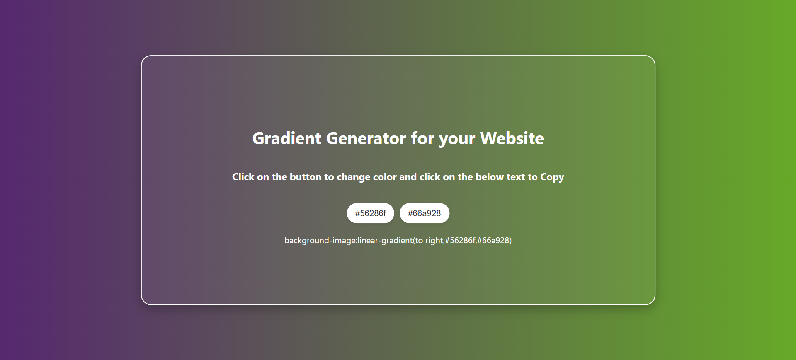

# 🎨 Gradient Background Generator

A stylish and interactive web tool that allows users to generate and copy CSS `linear-gradient` backgrounds using two randomly generated hex colors. Perfect for UI designers and frontend developers looking for color inspiration for websites or apps.

---

## 🔥 Live Features

- 🎨 **Random gradient** background between two colors
- 🖱️ **Buttons to regenerate** individual colors
- 📋 **Click to copy** the CSS background code
- ✨ **Beautiful animations and UI** with subtle hover effects
- 🌐 **Responsive and modern layout**

---

## 🧪 Preview

### Light/Dark Combinations




---

## 📁 Project Structure

gradient-generator/
├── gradientGenerator.html # Main HTML structure
├── gradientGenerator.css # Styling file
├── Gradient-Generator1.png # Screenshot preview
├── Gradient-Generator2.png # Screenshot preview
└── README.md # You’re here!


---

## 🚀 How to Use Locally

### 1. Clone the Repository

```bash
git clone https://github.com/yourusername/gradient-generator.git
cd gradient-generator
2. Run It
Simply open the gradientGenerator.html file in your browser:


start gradientGenerator.html
or drag and drop it into your browser window.

🛠️ How It Works
Two buttons (Color 1, Color 2) randomly generate new hex values on click.

These colors are applied to the body using a linear-gradient(to right, ...).

The background-image CSS code is shown below the buttons and is clickable to copy.

Subtle animations improve the user experience using CSS transitions and box-shadow.

📋 Copy to Clipboard Feature
Clicking the displayed CSS line:

background-image: linear-gradient(to right, #45c90a, #1d584f)
automatically copies it to your clipboard using the navigator.clipboard API.

🧑‍🎨 Tech Stack
HTML5

CSS3 (with Flexbox, transitions, and shadows)

JavaScript (for dynamic hex generation and clipboard interaction)

💡 Future Improvements
Allow manual color input (via color pickers)

Add direction options (e.g., to top, to left)

Export gradients as .css or .png

Add gradient presets

🙌 Acknowledgements
Thanks to Open Source UI color inspiration and cssgradient.io for gradient design inspiration.

📜 License
This project is licensed under the MIT License.

👨‍💻 Author
Made with 💻 and 🎨 by Raj Poddar

📧 Email: rajpoddar8907@gmail.com 

🌐 Portfolio --> https://rajakrp18.github.io/PortfolioMine/

🐱 GitHub --> https://github.com/rajakrp18